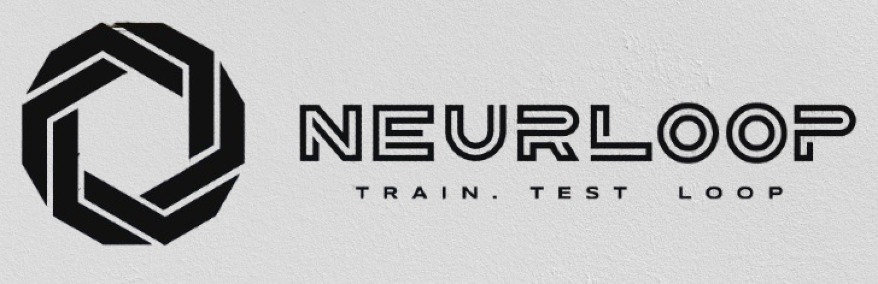

<h1 align="center">🧠 Neurloop</h1>

<i>AI compute and workflow engine designed for simplicity, high performance, and seamless distributed parallel training.</i>

  

  
  
  

---

## 🚀 Overview

**Neurloop** is a lightweight, flexible, and general-purpose AI workflow engine.  
It empowers developers, researchers, and institutions to automate training, evaluation, and deployment across various machine learning tasks — including classification, regression, forecasting, and more.

> **"Train. Test. Loop." — Neurloop keeps your AI in motion.**

---

## ⚙️ Features

- ✅ **General-purpose AI workflow engine**
- 🚀 **Optimized with Cython** for fast and efficient compute
- 🔁 **Workflow automation** via GitHub Actions or any provider
- 🧩 **Plug-and-play YAML configuration system** to define pipeline logic
- 🧑‍💼 **Use-case ready** for healthcare, education, retail, finance, and government
- 🔒 **Fully local or cloud-compatible**: no vendor lock-in
- 📦 **Containerized with Docker** for easy deployment anywhere
- 🔧 **Integrated with popular ML libraries:**
  - [x] **scikit-learn**: for classical ML workflows
  - [x] **PyTorch**: for deep learning modules (RNN, GRU, etc.)
  - [x] **TensorFlow**: for additional model compatibility
  - [x] **Hugging Face Transformers**: for NLP and LLM workflows
- 📤 **ONNX export support** for model portability
